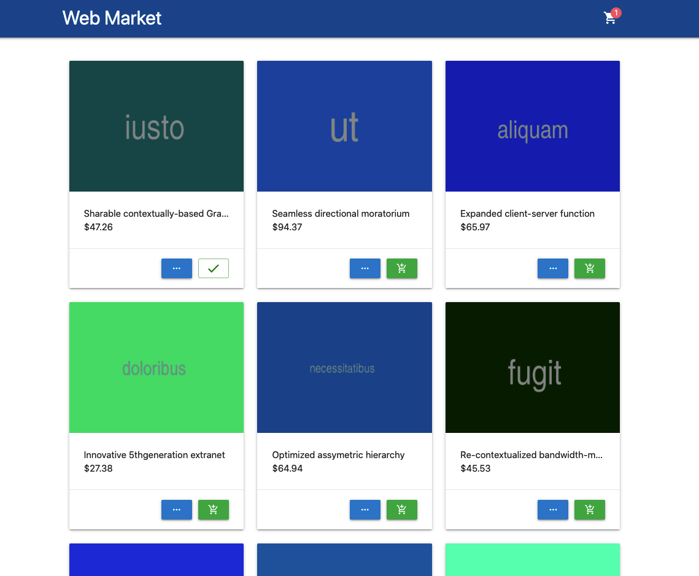

# Web Market 🌐

Web store implementation, test task

## Left to do
* Registration / Login
* Search
* Filter

## Available scripts

#### `yarn start` 

Use to deploy local development server

#### `yarn build`

Use to create an assembly in production mode

## Authors

* **Sergey Shvets** - [offreal](https://github.com/offreal)

## License

This project is licensed under the MIT License - see the [LICENSE](LICENSE) file for details
